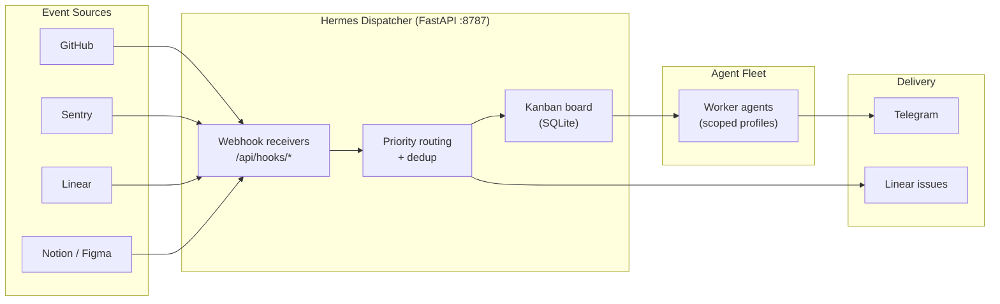
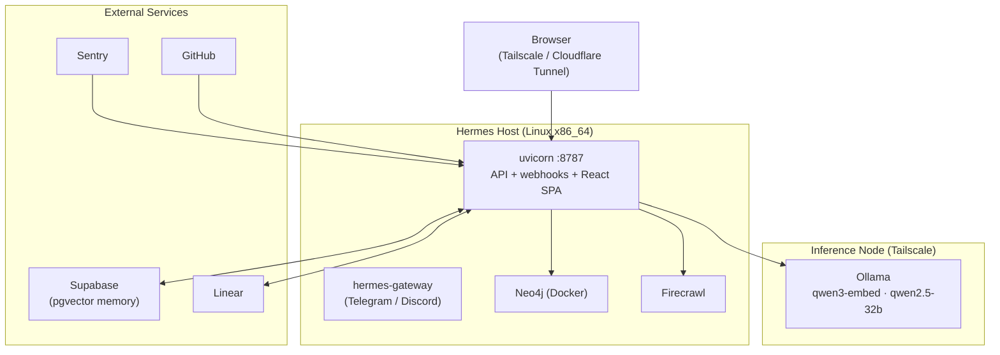

# Hermes Dispatcher

**Self-hosted mission control for a fleet of AI worker agents — dashboard, event-driven automation, and API backend in one FastAPI service.**

Hermes Dispatcher is the operational hub of a multi-agent AI platform. It provides a live web dashboard over an agent swarm, and a suite of inbound webhook receivers that turn events from development tools (GitHub, Sentry, Linear, Notion, Figma) into autonomous agent actions — creating issues, routing Kanban work to agents, storing knowledge, and notifying stakeholders in real time.

Built and operated in production as a personal platform: one server, ~15 API routers, 7 webhook integrations, and a React SPA, running 24/7 behind Tailscale and a Cloudflare Tunnel.

---

## Highlights

- **Agent orchestration** — Kanban-based task routing dispatches work to a roster of specialized worker agents, each with a defined profile and scoped tool permissions. Card priority maps to dispatch order; agent status is visible live on the board.
- **Autonomous incident intake** — a Sentry error alert becomes a Linear issue (deduplicated by Sentry event ID), then a prioritized Kanban card, then a Telegram notification — with no human in the loop until one is needed.
- **Operational visibility** — token usage and cost analytics per model, system metrics (CPU/GPU/RAM/network), live log streaming over SSE, session replay, and an activity heatmap across the agent fleet.
- **Governed memory** — a hybrid memory architecture: Supabase pgvector for semantic recall, Neo4j for a code knowledge graph, SQLite for board and session state, and markdown as the human-auditable pointer layer.
- **Security posture** — bcrypt-hashed session auth, git-ignored secrets, webhook signature verification, CORS allowlisting, and network exposure limited to Tailscale/Cloudflare Tunnel.

---

## Features

| Area | Capabilities |
|---|---|
| **Dashboard** | Kanban board with card detail drawer · Chat (streaming, multi-turn, model selection) · Overview (KPIs, agent breakdown, activity heatmap, system monitor) · Memory editor (MEMORY.md, USER.md, AGENTS.md, SOUL.md) · Insights (token usage, analytics) · Session browser/replay · Skill browser (100+ skills, toggle per platform) · Live log tail · Cron output viewer · Linear/Sentry feeds · Settings (theme, accent, prefs) |
| **Webhook integrations** | GitHub (push/PR/issue/review) · Sentry (error alerts → Linear issue) · Linear (issue/comment events → Kanban + Telegram) · Figma (file/comment events) · Notion (page updates + poll sync) · Knowledge store (Supabase INSERT trigger) · Kanban status sync |
| **Autonomous intake** | Sentry error → Linear issue (deduped by Sentry ID) → Kanban card → Telegram notify. Priority-mapped between Linear urgency and Kanban scores. |
| **Data stores** | Supabase pgvector (primary memory — semantic search) · Neo4j (code knowledge graph) · SQLite (Kanban + sessions) · Local markdown (MEMORY.md pointer layer) |

---

## Architecture

### Event flow

How an external event becomes agent work:



### Deployment topology

Where everything runs:



**In plain terms:** a single uvicorn process serves the API, the webhook receivers, and the pre-built React dashboard. The gateway handles chat platforms. Semantic memory lives in Supabase, the code graph in a local Neo4j container, and embeddings/local inference run on a separate GPU node reached over Tailscale. Nothing is exposed to the public internet except through the Cloudflare Tunnel.

---

## Quick Start

```bash
# Backend
cd hermes-dispatcher
python3 -m venv .venv
source .venv/bin/activate
pip install -r requirements.txt

# Create a password hash (required)
python3 -c "import bcrypt; open('.dashboard_passwd_hash','wb').write(bcrypt.hashpw(b'yourpassword', bcrypt.gensalt(rounds=12)))"

# Start
bash start-server.sh
# → Serves dashboard at http://<host>:8787
```

The dashboard SPA is pre-built in `app/dist/` and served automatically by uvicorn. For frontend development:

```bash
cd app
npm install
npm run dev
```

---

## API Surface

| Router | Prefix | Purpose |
|---|---|---|
| `auth` | `/api/login`, `/api/logout`, `/api/session` | Session cookie auth (bcrypt) |
| `kanban` | `/api/kanban` | Kanban board CRUD |
| `chat` | `/api/chat/*` | Agent chat + SSE streaming |
| `sessions` | `/api/sessions` | Past session browser |
| `memory` | `/api/memory` | Memory editor |
| `skills` | `/api/skills` | Skill browser + toggle |
| `agents` | `/api/agents` | Live agent roster |
| `overview` | `/api/overview` | Dashboard stats |
| `insights` | `/api/insights` | Token usage + analytics |
| `system` | `/api/system` | CPU/GPU/RAM/network metrics |
| `logs` | `/api/logs` | Live log tail (SSE) |
| `settings` | `/api/settings` | Dashboard preferences |
| `search` | `/api/search` | Cross-panel search |
| `cron` | `/api/cron` | Cron job output |
| `hooks` | `/api/hooks/*` | Inbound webhook receivers |
| `sentry` | `/api/sentry/messages` | Sentry alert feed |
| `linear` | `/api/linear/*` | Linear issue views |
| `notify` | `/api/notify` | Internal Telegram notification |

All routes serve under `/api`. Webhooks are at `/api/hooks/{github,sentry,linear,figma,notion,knowledge,kanban}`.

---

## Configuration

| Variable | Default | Purpose |
|---|---|---|
| `HERMES_DISPATCHER_PORT` | `8787` | Primary bind port |
| `HERMES_DISPATCHER_BIND_RETRIES` | `3` | Retries on EADDRINUSE |
| `HERMES_DISPATCHER_BIND_BACKOFF` | `2.0` | Seconds between retries |
| `HERMES_DISPATCHER_FALLBACK_PORTS` | — | Comma-separated fallback ports |
| `DASHBOARD_CORS_ORIGINS` | Tailscale + CF domains | Override CORS allowlist |
| `HERMES_HOME` | `~/.hermes` | Hermes data root |
| `OLLAMA_HOST` | — | Inference-node Ollama endpoint (for embeddings) |

Required secrets stored in `.env` (git-ignored): `LINEAR_API_KEY`, `SENTRY_*`, `NEO4J_*`, `SUPABASE_*`, `GITHUB_WEBHOOK_SECRET`, etc.

---

## Stack

| Layer | Technology |
|---|---|
| Frontend | React 18, TypeScript, Vite, Tailwind CSS, Framer Motion |
| Backend | FastAPI (Python 3.11), uvicorn |
| Data | SQLite, Supabase pgvector, Neo4j (code graph) |
| Auth | Session cookie (`hd_session`), bcrypt (rounds=12) |
| Hosting | Self-hosted on Linux x86_64 |

---

## Branches

| Branch | Purpose |
|---|---|
| `master` | Dispatcher — API, webhooks, dashboard SPA |
| `hermes-agent` | Agent-side skills, patches, and setup |
